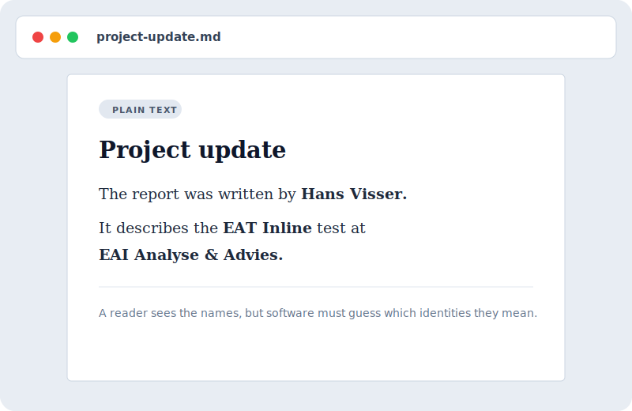
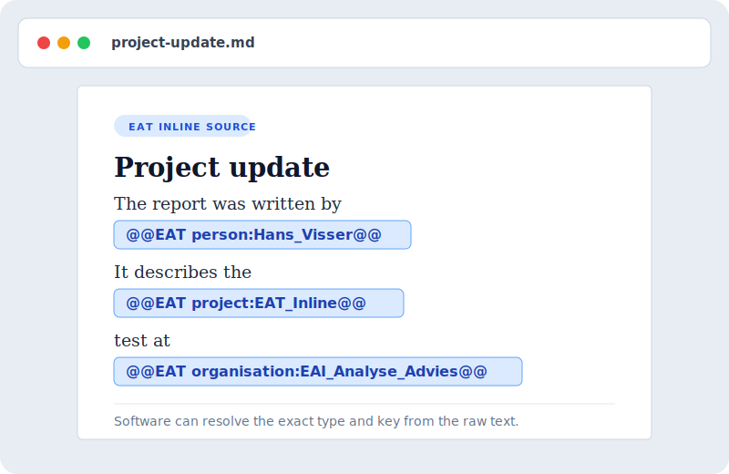

# EAT Inline

**A small plain-text tag that tells software exactly which person, place or
thing a sentence refers to.**

[](https://github.com/E-AI-MODEL/EAT-inline/actions/workflows/ci.yml)
[](https://github.com/E-AI-MODEL/EAT-inline/actions/workflows/conformance.yml)
[](https://github.com/E-AI-MODEL/EAT-inline/actions/workflows/benchmark.yml)
[](https://github.com/E-AI-MODEL/EAT-inline/actions/workflows/docs.yml)

## The idea in one minute

A name in ordinary text can point to several people or things:

```text
The report was written by Hans Visser.
```

EAT Inline puts the intended identity in the text:

```text
The report was written by @@EAT person:Hans_Visser@@.
```

EAT Inline has one construct:

```text
@@EAT type:key@@
```

The sentence describes the relationship. The tag identifies the subject.

> Version `0.3.2` is experimental. It can be tested, but it is not yet a proven
> or frozen standard.

## The problem and the proposed solution

| Problem | EAT Inline approach |
|---|---|
| The same name can refer to different identities. | Store an explicit type and key, such as `person:Hans_Visser`. |
| Identity metadata stored elsewhere can become separated from the sentence. | Keep the identity reference inside the source text. |
| Rich markup often belongs to one document format or application. | Use one plain-text form that a small parser can read. |
| A link usually says where to go. It does not always say what type of identity it represents. | Separate the entity type from the key. |

EAT Inline still needs a registry that knows what each key means. It does not
solve name matching by itself, and file-format round trips have not yet been
tested.

## How it differs from other inline forms

These alternatives are useful for other jobs. The last column describes the
tradeoff when the job is exact identity.

| Inline form | Example | Useful for | Tradeoff for exact identity |
|---|---|---|---|
| Markdown link | `[Hans](https://example/Q123)` | Clickable text | The identity depends on the chosen URL, and the link syntax has no separate entity type. |
| HTML data attribute | `<span data-entity="Q123">Hans</span>` | Metadata inside HTML | It only works as structured HTML and adds opening and closing markup. |
| XML element | `<entity id="Q123">Hans</entity>` | Rich structured documents | It needs XML parsing, nesting rules and a closing element. |
| Hashtag | `#HansVisser` | Loose grouping and discovery | It does not by itself separate a type, key and visible label. |
| EAT Inline | `@@EAT person:Hans_Visser@@` | A typed identity in plain text | The raw tag is visible, needs a registry and currently carries no separate display label. |

EAT Inline is smaller than the HTML and XML examples and more explicit than a
free-form hashtag. A Markdown link can also use a stable identity URL. EAT
chooses a typed key instead of making the destination URL part of the core
syntax.

## See it in a document

The two mock screenshots show the same text before and after adding EAT
references.

| Without EAT | With EAT in the source text |
|---|---|
|  |  |

The right-hand image shows the literal stored text. An editor could display the
tag differently. These images do not claim tested support for Word, PDF or
another file format.

## What has been tested?

The repository contains four different test groups:

| Test | Size | Question |
|---|---:|---|
| Format checks | 76 records | Does parsing, typing, lookup and text generation behave as specified? |
| Public name-to-ID test | 40 Wikipedia pages | What changes when correct EAT identities assist one fixed text model? |
| Full-tag volume test | 100,000 generated documents | Can 1,672,500 inline references be parsed, indexed and searched? |
| One-tag search test | 100,000 generated documents | What changes in search when every document has exactly one EAT tag? |

The 100,000-document tests repeat public source material. They measure
processing volume, not the variety of 100,000 different articles.

### Public test on 40 Wikipedia pages

The public test contains:

- 40 complete test pages;
- 669 marked text positions;
- 434 different Wikidata identities;
- 1,063 possible identities in the lookup list.

Coverage counts marked text positions, not files. At 50% coverage, 335 of the
669 positions contain an EAT reference. The other 334 stay as ordinary text.


| EAT coverage | Requested identities found | Missed identities |
|---:|---:|---:|
| 0% | 69.37% | 136 |
| 50% | 85.59% | 64 |
| 100% | 100% | 0 |

“Requested identities found” is recall: the share of known identities that the
test found. Full coverage removed all 136 misses. It still left 94 incorrect
extra predictions from the text model outside the tagged positions.

The test generated EAT references from the known answers. People did not write
them, and the model did not discover them. The result shows the best case after
correct identities are supplied.

### Volume test with 100,000 generated documents

This test repeated the 40 public pages and assigned every copy a different
document ID. It processed:

- 100,000 generated documents;
- 1,672,500 EAT references;
- 276.8 MB of EAT text;
- 42,942 documents per second while parsing and building the index.

The index built from inline EAT contained exactly the same document-identity
pairs as a control that received the correct IDs as separate data.

This proves that the reference implementation handled this workload. It does
not represent 100,000 different source documents or a production search
engine. Timing depends on the machine.

### Search test with one EAT tag per document

This separate test generated 100,000 document IDs with exactly one EAT
reference each. It asked 434 questions such as:

```text
Which source page mentions University of Southampton?
```

Four search methods received different information:

| Search method | What it receives |
|---|---|
| Name search | The visible name as ordinary search text |
| EAT after a unique name match | The same visible name; EAT is used only when the lookup list links that name to one ID |
| EAT with the answer ID | The correct ID from the test answers |
| Combined search with the answer ID | Ordinary name search plus the correct ID from the test answers |

The connection to the inline tag looks like this:

```text
Document text:  ... @@EAT entity:Q123@@ ...
Visible query:  Which source page mentions Example name?
Lookup match:   Example name -> Q123
EAT search:     keep only text results tagged entity:Q123
```

A **gold ID** is the technical term for the known correct ID in the test answer
sheet. This README calls it the **answer ID**. The name-match method does not
receive that answer. It must find one unambiguous match before it can use EAT.

Of 434 visible names, 427 matched one identity. Seven names, including
`Cambridge` and `gold`, matched more than one. The system did not guess those
IDs. It used ordinary name search for them.


| Search method | Correct source answers | Correct text first | Correct text in top 10 |
|---|---:|---:|---:|
| Name search | 336 of 434 (77.42%) | 77.42% | 82.72% |
| EAT after a unique name match | 429 of 434 (98.85%) | 98.85% | 99.77% |
| EAT with the answer ID | 434 of 434 (100%) | 100% | 100% |
| Combined search with the answer ID | 434 of 434 (100%) | 100% | 100% |

“Correct text in top 10” means that at least one correct text result appeared
among the first ten search results. The technical metric name is Hit@10.

This test covers finding source text and selecting its page. It does not use a
language model to write an answer. The two answer-ID methods are controls that
receive the correct ID from the test answers.

## What has not been tested?

The repository does not yet show:

- behaviour over 100,000 different source documents;
- identity matching from aliases, paraphrases or complete natural-language
  questions;
- answers written by a language model;
- how accurately or quickly people write EAT references;
- reliable round trips through Word, PDF, Excel, Markdown or HTML;
- production readiness.

## For implementers

Both `type` and `key` use:

```text
[A-Za-z_][A-Za-z0-9_]*
```

A parser can extract every `@@EAT type:key@@` reference with a regular
expression. A resolver then maps the written type and key to an internal ID.

- [`SPEC.md`](SPEC.md) defines the grammar and compatibility rules.
- [`BENCHMARKS.md`](BENCHMARKS.md) contains the full methods, metrics, timing
  tables, limits and reproduction commands.
- [`schemas/registry-entry.schema.json`](schemas/registry-entry.schema.json)
  defines a registry record.
- [`GOVERNANCE.md`](GOVERNANCE.md) describes change control.
- [`CHANGELOG.md`](CHANGELOG.md) records releases and compatibility changes.

Run the standard checks:

```bash
python -m pip install -e .
python -m unittest discover -s tests -p "test_*.py" -v
python scripts/run_conformance.py
python scripts/validate_dataset.py
python scripts/run_benchmark.py
python scripts/run_comparative_benchmark.py
python scripts/check_docs.py
```

## Stewardship and license

EAT Inline is developed by **Hans Visser** under **EAI Analyse & Advies**.
It is licensed under the [Apache License 2.0](LICENSE).
