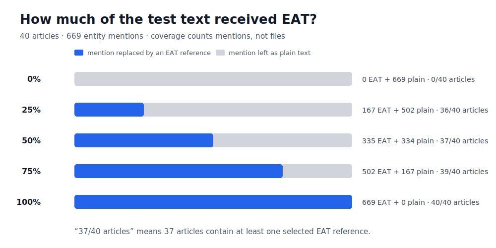
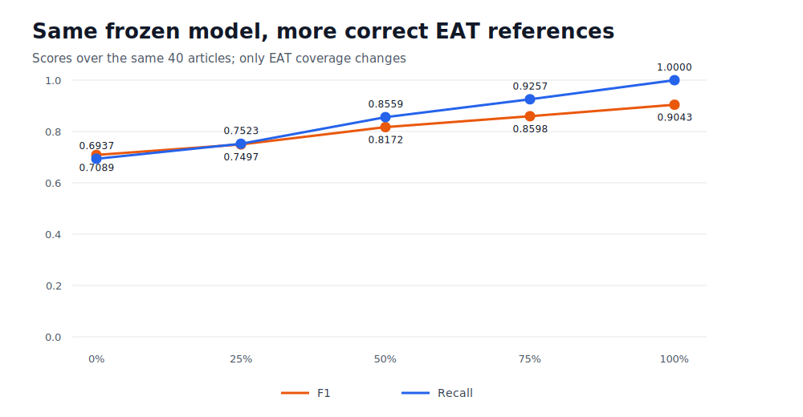
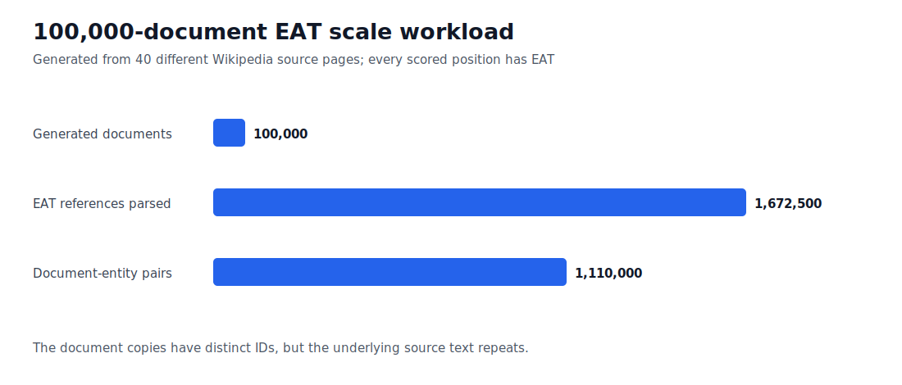
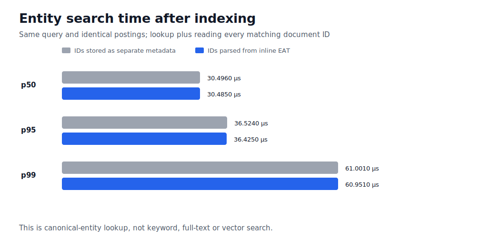

# EAT Inline

**A small tag that tells software exactly which person, place or thing a sentence refers to.**

[](https://github.com/E-AI-MODEL/EAT-inline/actions/workflows/ci.yml)
[](https://github.com/E-AI-MODEL/EAT-inline/actions/workflows/conformance.yml)
[](https://github.com/E-AI-MODEL/EAT-inline/actions/workflows/benchmark.yml)
[](https://github.com/E-AI-MODEL/EAT-inline/actions/workflows/docs.yml)

## The whole idea

Plain text can leave a name open to interpretation:

```text
The report was written by Hans Visser.
```

EAT Inline puts the intended identity in the text:

```text
The report was written by @@EAT person:Hans_Visser@@.
```

EAT Inline has one construct:

```text
@@EAT type:key@@
```

The surrounding sentence still describes the relationship. The EAT reference
only identifies the entity.

> Version `0.3.2` is experimental. It can be tested, but it is not yet a proven
> or frozen standard.

## What has actually been tested?

The repository contains two separate test groups:

| Test group | Size | What it checks |
|---|---:|---|
| Small synthetic tests | 76 records | Syntax, typing, resolution, generation and controlled comparisons |
| Small public-text test | 40 Wikipedia pages | Entity linking with one frozen TF-IDF model |

The graphs below describe only the 40-page test. This is enough for a
controlled correctness check. It is not a large-scale or speed test.

### Size of the public test

- **40 test documents**, each copied from one complete English Wikipedia page
- **669 marked places in the text** where a person, place, organisation or
  another Wikidata item appears
- **434 different Wikidata items**
- **1,063 possible entities** in the closed lookup registry

The test stores those 40 documents as 40 records in one JSONL file. JSONL is
only the test container. It makes the input easy to hash, replay and score. It
is not a required EAT Inline document format.

### One document with and without EAT

This excerpt comes from one of the 40 Wikipedia pages.

Without EAT:

```text
Sameli Ventelä is a Finnish professional ice hockey defenceman.
```

With EAT on every scored item in the excerpt:

```text
@@EAT entity:Q26720335@@ is a @@EAT entity:Q33@@ professional
@@EAT entity:Q41466@@ defenceman.
```

The `Q` numbers are stable Wikidata IDs used by this public test. A different
resolver can use readable keys such as `person:Hans_Visser`.

### What does 50% EAT coverage mean?

Coverage counts the 669 marked text positions, not documents or files.

- `0%` means 0 of the 669 positions have an EAT reference.
- `50%` means 335 positions have an EAT reference. The other 334 stay as plain
  text.
- `100%` means all 669 positions have an EAT reference.

At 50% coverage, the selected positions occur in 37 of the 40 documents. At
100%, all 40 documents contain EAT references.



| Coverage | Text positions with EAT | Text positions left plain | Documents containing EAT |
|---:|---:|---:|---:|
| 0% | 0 | 669 | 0 of 40 |
| 25% | 167 | 502 | 36 of 40 |
| 50% | 335 | 334 | 37 of 40 |
| 75% | 502 | 167 | 39 of 40 |
| 100% | 669 | 0 | 40 of 40 |

The same model predictions are reused at every level. A correct EAT reference
replaces the model prediction only at that selected text span.

### What happened to the model score?



| EAT coverage | Precision | Recall | F1 | Missed entities |
|---:|---:|---:|---:|---:|
| 0% | 0.7247 | 0.6937 | 0.7089 | 136 |
| 25% | 0.7472 | 0.7523 | 0.7497 | 110 |
| 50% | 0.7819 | 0.8559 | 0.8172 | 64 |
| 75% | 0.8027 | 0.9257 | 0.8598 | 33 |
| 100% | 0.8253 | 1.0000 | 0.9043 | 0 |

In this test:

- Half coverage removed 72 of the model's 136 missed entities.
- Full coverage removed all 136 missed entities.
- Full coverage still left 94 false positives from model predictions outside
  the EAT-tagged spans.

### What this result does and does not show

The test shows what happens when correct entity identities are supplied to the
same frozen model pipeline.

The EAT references were generated from the known test answers. People did not
write them, and the model did not discover them. The result is an upper bound,
not proof that authors can add EAT references accurately or quickly.

The EAT-only score is `1.0` because it reads those known correct identities
directly. That number is a resolver check, not a model achievement.

## 100,000-document scale test

The scale test creates 100,000 workload documents by repeating the 40 source
pages and assigning every copy a different document ID. Every scored text
position has EAT.



The run processed:

- 100,000 generated documents;
- 1,672,500 EAT references;
- 1,110,000 document-entity pairs;
- 276.8 MB of EAT text.

The inline references added 16.8 MB, or 6.5%, to the 259.9 MB plain-text
workload. The 32-bit postings payload was 4.44 MB, excluding Python container
overhead.

The control stores the same correct entity IDs as separate metadata. The EAT
route parses those IDs from the inline references. Both routes produced exactly
the same entity-to-document index.

| Index build | Time | Throughput |
|---|---:|---:|
| Correct IDs supplied as separate metadata | 0.051 s | not comparable |
| Correct IDs parsed from inline EAT | 2.329 s | 42,942 documents/second |

The search test queried all 434 entities twenty times and read 22,200,000
matching document IDs.



| Search route | p50 | p95 | p99 |
|---|---:|---:|---:|
| Index built from separate metadata | 30.496 µs | 36.524 µs | 61.001 µs |
| Index built from inline EAT | 30.485 µs | 36.425 µs | 60.951 µs |

The p50 difference was 0.011 microseconds. That is inside measurement noise,
not evidence that either route is faster. Once indexing is complete, both
searches use the same index and EAT is no longer in the query path.

This proves that the reference implementation can parse and index this
100,000-document workload, and that the resulting index behaves like the
metadata control in this test. It does not represent 100,000 different source
documents or a production search engine. Timings depend on the machine.

### File formats

This experiment scores extracted plain text. It does not yet test whether EAT
references survive opening, editing, exporting and reading:

- Word documents;
- PDFs;
- Excel workbooks;
- Markdown files;
- HTML pages or HTML metadata.

Each format needs its own import and export test. PDF needs extra attention
because it is a page-layout format, not a reliable source-text format.

## Using the format

Examples:

```text
@@EAT person:Hans_Visser@@
@@EAT organisation:EAI_Analyse_Advies@@
@@EAT project:EAT_Inline@@
```

Both `type` and `key` use:

```text
[A-Za-z_][A-Za-z0-9_]*
```

A minimal parser needs only a regular expression:

```python
import re

REFERENCE_RE = re.compile(
    r"@@EAT (?P<type>[A-Za-z_][A-Za-z0-9_]*):"
    r"(?P<key>[A-Za-z_][A-Za-z0-9_]*)@@"
)
```

A resolver can map the written reference to an internal ID:

```json
{
  "source_reference": "@@EAT person:Hans_Visser@@",
  "canonical_id": "person-10492",
  "resolution_status": "resolved"
}
```

EAT Inline is the writing format. Databases, registries and resolution metadata
belong to the system using it.

## Documentation and reproduction

- [`SPEC.md`](SPEC.md) defines the grammar and compatibility rules.
- [`BENCHMARKS.md`](BENCHMARKS.md) explains every test condition, metric,
  limitation and reproduction command.
- [`schemas/registry-entry.schema.json`](schemas/registry-entry.schema.json)
  defines a registry record.
- [`GOVERNANCE.md`](GOVERNANCE.md) describes change control.
- [`CHANGELOG.md`](CHANGELOG.md) records releases and compatibility changes.

Run the standard checks:

```bash
python -m pip install -e .
python -m unittest discover -s tests -p "test_*.py" -v
python scripts/run_conformance.py
python scripts/validate_dataset.py
python scripts/run_benchmark.py
python scripts/run_comparative_benchmark.py
python scripts/check_docs.py
```

## Current limits

The repository does not yet show:

- behaviour over 100,000 different source documents;
- keyword, full-text, semantic or vector-search performance;
- how accurately people write EAT references;
- how much writing time EAT adds;
- reliable round trips through Word, PDF, Excel, Markdown or HTML;
- performance against a strong NER, entity-linking or LLM baseline;
- improved retrieval or RAG results;
- production readiness.

Those questions need new tests with people, stronger models and larger public
datasets.

## Stewardship and license

EAT Inline is developed by **Hans Visser** under **EAI Analyse & Advies**.
It is licensed under the [Apache License 2.0](LICENSE).
