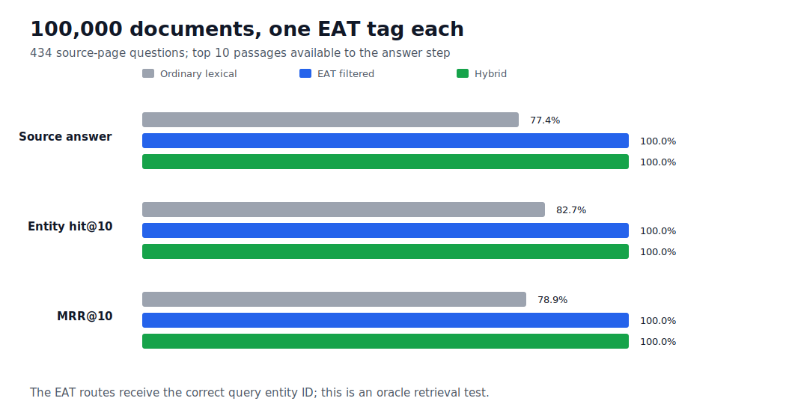
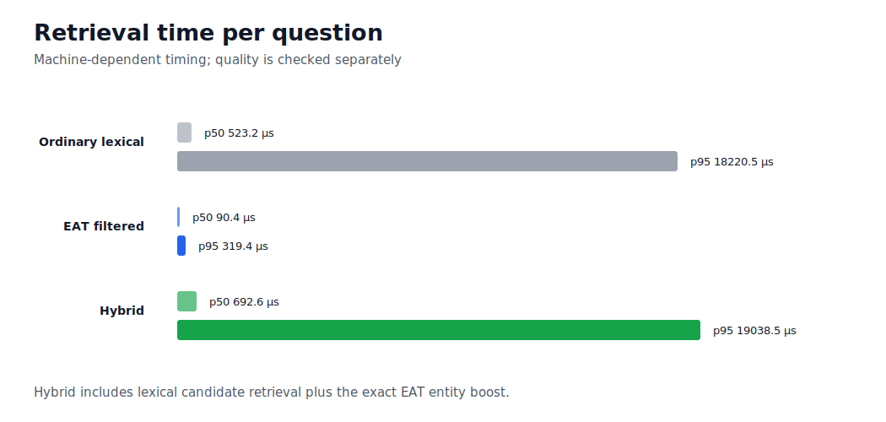

# 100,000-document search test with one EAT tag

## What ran

- 100,000 generated workload documents
- 669 annotated text excerpts from 40 Wikipedia pages
- 100,000 EAT references: exactly one per document
- 434 entity questions
- name search, EAT after a name match, and two answer-ID controls
- a deterministic answer step that returns the selected source-page title

The question asks which source page mentions a registry name. Name search uses it as ordinary text. EAT after a unique name match gets only that name and uses the tag when the registry has exactly one matching ID. Two control methods receive the correct ID directly from the test answers. The technical name for that known answer is the gold ID.

## Matching a name without the answer ID

- 427 of 434 labels resolved uniquely (98.4%)
- 7 labels were ambiguous and fell back to ordinary name search
- 0 wrong entity-ID guesses

The system does not guess when a name is ambiguous. This tests exact registry names, not aliases or names hidden inside a longer question.

## Search and source-answer results

| Search method | Correct source answer | Correct text first | Correct text in top 10 |
|---|---:|---:|---:|
| Name search | 0.7742 | 0.7742 | 0.8272 |
| EAT after a unique name match | 0.9885 | 0.9885 | 0.9977 |
| EAT with the answer ID | 1.0000 | 1.0000 | 1.0000 |
| Combined search with the answer ID | 1.0000 | 1.0000 | 1.0000 |

A text result is correct when the requested identity is known to occur inside it. A source answer counts only when the first text result contains that evidence before its page title is returned.

## Search time

| Search method | p50 | p95 | p99 |
|---|---:|---:|---:|
| Name search | 546.493 µs | 19950.143 µs | 32507.424 µs |
| EAT after a unique name match | 93.063 µs | 371.172 µs | 1257.259 µs |
| EAT with the answer ID | 89.042 µs | 328.979 µs | 617.629 µs |
| Combined search with the answer ID | 731.052 µs | 20697.574 µs | 33963.118 µs |

Timings depend on the machine. CI checks the complete workload, exact tag count and recorded quality invariants, not a fixed speed limit.

## Boundary

Finding source text and selecting its page are the first part of a RAG pipeline. This test does not run embeddings, a vector database or a language model. The 100,000 documents repeat 669 text excerpts from 40 source pages, so they are not 100,000 different source documents. The two answer-ID methods receive the correct ID from the test answers; EAT after a unique name match does not.
